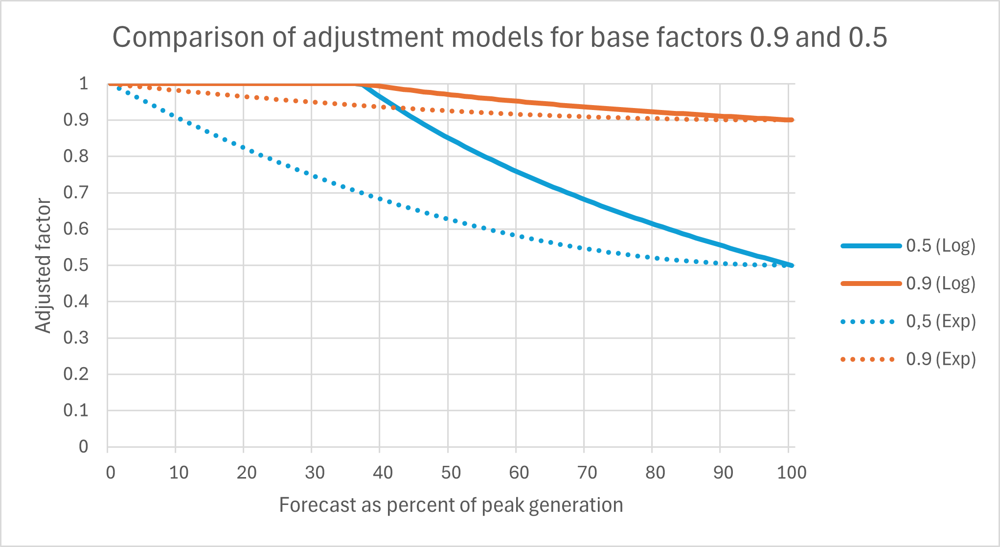

# Advanced options

It is possible to alter the behaviour of some integration functions by creating a file called `solcast-advanced.json` in the Home Assistant configuration directory `solcast_solar` subdirectory.

This file has a JSON structure of a dictionary containing key/value pairs.

Example:

```
{
    "option_key_one": value,
    "option_key_two": value
}
```

Changes to this file will be detected in near-real time, changing code behaviour. The impact of that changed behaviour may only be seen at forecast or estimated actuals update. For other changes, `reload_on_advanced_change` can be set to `true` (see below), so that things like dampening modelling and entity set up can occur on reload.

The impact of not restarting will vary by advanced option, and you are left to decide when the outcome should occur. This is advanced, and _you_ are expected to be advanced about option application. If you're unsure then just set `reload_on_advanced_change` while testing.

Support for these advanced options will be limited. (Well, "support" for this integration is limited at the best of times. You expect it, yet we are not obliged to provide it; we endeavour to.)

Understand the implication of setting any of these options before reporting any problem, and check that set values are sensible, and if you then need to seek help, clearly outline any problem faced in detail in a discussion. Any value set is logged at `DEBUG` level, so please include that detail.

These options modify otherwise predictable and well-tested behaviour, so you are wandering into poorly tested/test-it-yourself territory, where enabling `DEBUG` logging will likely be essential to see what's going on.

Values are validated for individual sanity, however it is possible to set multiple option values together in an inappropriate way. Do not raise a problem report in this circumstance. You broke it. You fix your config, or revert to defaults and reload, or raise a discussion topic instead.

You are free to raise an issue should a code exception occur after setting an advanced option, and `DEBUG` logging is _mandatory_ in this circumstance. Exceptions should not happen, and there will be no exception to requiring `DEBUG` logs in a raised issue.

## Contents

1. [Automated dampening](#automated-dampening)
1. [Estimated actuals](#estimated-actuals)
1. [Forecasts](#forecasts)
1. [General](#general)

## Automated dampening

**Key: "automated_dampening_delta_adjustment_model"**

Possible values: integer `0`,`1` (default `0`)

Allows the selection of different calculations to nudge the base dampening factors closer to 1.0 when forecast generation for an interval is below the recent peak.

Option `0` selects an adjustment based on the logarithmic difference between peak and forecast:

    adjusted_factor = base_factor + ((1 - base_factor) * (ln(interval_peak) - ln(interval_forecast)))
   
Option `1` selects an adjustment based on the squared ratio of forecast and peak:

    adjusted_factor = base_factor + ((1 - base_factor) * ((1-(interval_forecast/interval_peak))^2))
   
Adjusted dampening factors are constrained to lie within the range 0 to 1.  The chart below illustrates the behaviour of the two different adjustment calculations for base factors of 0.5 and 0.9.  



As the forecast generation decreases in relation to the recent generation peak the logarithmic difference calculation tends to give a higher adjusted factors than the squared ratio calculation.  The logarithmic difference calculation will give an adjusted factor of 1.0 for any forecast below around 36% of the peak whereas the adjusted factor from the squared ratio calculation only approaches 1.0 as forecast generation approaches 0.

**Key: "automated_dampening_generation_fetch_delay"**

Possible values: int `0`..`120` (default `0`)

A number of minutes to delay beyond midnight before generation history is retrieved.

This value must be less than the estimated actual fetch delay option.

If Home Assistant is restarted in the period between midnight and generation being retrieved then retrieval will be rescheduled.

**Key: "automated_dampening_generation_history_load_days"**

Possible values: integer `1`..`21` (default `7`)

By default, the integration assumes that there will not be generation history available beyond seven days. If Home Assistant is configured with `purge_keep_days` of a longer period for `recorder`, then this option may be used to accelerate the time to accuracy for automated dampening results.

This history load occurs when there is no `solcast-generation.json` present. An integration reload is required after deleting the generation cache file.

**Key: "automated_dampening_ignore_intervals"**

Possible values: list of strings as "HH:MM" (default `[]`)

Certain intervals of the day can be set to be ignored by dampening, at times when there is no possibility of shading.

A possible use case is to avoid situations where there are many matching estimated actual intervals and a small number of lower older generation intervals that lack an export limiting flag. This can only occur when `automated_dampening_no_limiting_consistency` is set to `true`, and may be seen as days get longer towards Summer.

Double quotes are valid JSON format (single quotes are not). Times are specified in local time zone, and must match the format "HH:MM" with one or two digit hour and a minute of either "00" or "30", and be unique in the list.

An example list: `["12:00", "12:30", "13:00", "13:30", "14:00", "14:30", "15:00"]`

**Key: "automated_dampening_insignificant_factor"**

Possible values: float `0.0`..`1.0` (default `0.95`)

Dampening values modelled as higher than a certain threshold are ignored as insignificant.

**Key: "automated_dampening_insignificant_factor_adjusted"**

Possible values: float `0.0`..`1.0` (default `0.95`)

Dampening values adjusted by delta adjustment as higher than a certain threshold are ignored as insignificant.

**Key: "automated_dampening_minimum_matching_generation"**

Possible values: integer `1`..`21` (default `2`)

Dampening modelling will skip intervals where there are a low number of matching generation samples for intervals. This is defaulted at two to get a "peak" generation value, but a value of one is also allowed for experimentation.

This value must be less than or equal to the minimum matching intervals or the number of past days considered for automated dampening.

**Key: "automated_dampening_minimum_matching_intervals"**

Possible values: integer `1`..`21` (default `2`)

Dampening modelling will skip intervals where there are a low number of matching past intervals. A low number of matches are generally seen at the beginning and end of each day, and these are ignored by default.

This value must be greater than or equal to the minimum matching generation, or higher than the number of past days considered for automated dampening.

**Key: "automated_dampening_model"**

Possible values: integer `0`..`3` (default `0`)

Selects the algorithm to be used to determine automated dampening factors.

Option `0` is the default model described in the documentation.  This compares the recent peak estimated actual with the recent peak generation for each interval to calculate a dampening factor.  In this model it is possible that the peak estimated actual and peak generation occur on different days.

Options `1` to `3` follow a similar approach to the above, but calculate a list of candidate factors from the paired generation and estimated actual data in each interval, so each candidate factor is calculated from a single day.  

- Option `1` returns the maximum of the candidate factors.
- Option `2` returns the mean of the candidate factors.
- Option `3` returns the minimum of the candidate factors.

Option `1` can be thought of as a most optimistic scenario which will tend to give a higher forecast than Option `2`, with Option `3` as the most pessimistic scenario giving the lowest forecast.      

**Key: "automated_dampening_model_days"**

Possible values: integer `2`..`21` (default `14`)

The maximum number of days of past estimated actuals and generation to use for modelling future dampening.

**Key: "automated_dampening_no_delta_adjustment"**

Possible values: boolean `true`/`false` (default `false`)

If delta logarithmic adjustment of dampening factors is not desired then this option may be set to `true`.

**Key: "automated_dampening_no_limiting_consistency"**

Possible values: boolean `true`/`false` (default `false`)

Default limiting behaviour is that whenever export limiting of generation is seen (either by export limit detection, or manual limiting by using the entity `solcast_suppress_auto_dampening`) then all of the same intervals of generation will be ignored over the period defined by `automated_dampening_model_days`, which is `14` by default.

Said another way, the default behaviour is that if there is limiting detected for any interval on any day, then that interval will be ignored for every day of the past fourteen days unless this option is enabled.

Set this option to `true` to prevent this behaviour.

**Key: "automated_dampening_preserve_unmatched_factors"**

Possible values: boolean `true`/`false` (default `false`)

Default behaviour when calculating base dampening factors is that any interval with insufficient matching intervals or generation (see `automated_dampening_minimum_matching_generation` and `automated_dampening_minimum_matching_intervals`) will have a dampening factor of 1.0.  This can be an issue if there is a sustained period of poor solar generation (e.g. a sustained cloudy spell) when previously calculated dampening factors for these intervals may be reset to 1.0 leading to a higher generation forecast until sufficient 'good' intervals are recorded and the dampening factors can be recalculated.

Setting this option to `true` will retain the previously calculated factor for such an interval, with factors reverting to 1.0 when all recent estimated actuals for the interval are 0.

**Key: "automated_dampening_similar_peak"**

Possible values: float `0.0`..`1.0` (default `0.9`)

Estimated actual peaks are compared to find a similar number of "matching" peaks from which to compare maximum generation. By default this is intervals within 90% to 100% of peak.

This option varies what is considered a similar interval from all modelled days.

**Key: "automated_dampening_suppression_entity"**

Possible values: string (default `"solcast_suppress_auto_dampening"`)

A templated suppression entity in the `sensor`, `binary_sensor` or `switch` platform can be used to intentionally ignore intervals of generation. This option allows the entity name searched for to be changed.

## Estimated actuals

**Key: "estimated_actuals_fetch_delay"**

Possible values: int `0`..`120` (default `0`)

A number of minutes to delay beyond midnight before estimated actuals are retrieved (in addition to a randomised up-to fifteen minute delay). This may be of use should the retrieval of estimated actuals often fail just after midnight local time.

If automated dampening is enabled then modelling of new dampening factors will occur immediately following retrieval.

If Home Assistant is restarted in the period between midnight and estimated actuals being retrieved then retrieval will be rescheduled.

**Key: "estimated_actuals_log_ape_percentiles"**

Possible values: list[int] (default [50])

By default a 50th percentile Actual Percentage Error (APE) is logged on day change and at startup. Specify alternate or more percentiles to analyse with this option.

**Key: "estimated_actuals_log_mape_breakdown"**

Possible values: boolean `true`/`false` (default `false`)

A Mean Actual Percentage Error (MAPE) value for estimated actuals vs. actual generation is logged on day change and at startup. Enable this option to also log the daily percentage error (APE).

Both undampened and dampened are logged when automated dampening is enabled.

Note: Totals for both generation and estimated actuals do not include half-hourly intervals that have experienced site export limiting.

## Forecasts

**Key: "forecast_day_entities"**

Possible values: integer `8`..`14` (default `8`)

The number of forecast day entities to create (plus one). By default seven entities are created. Today, tomorrow, day 3, day 4, day 5, day 6 and day 7. This option enables creation of up to a day 13 entity.

An integration reload is required to vary the number of entities. New entities created will be disabled by default, and if this option is reduced then entities will be cleaned up.

This value must be less than or equal to the number of forecast future days.

**Key: "forecast_future_days"**

Possible values: integer `8`..`14` (default `14`)

The number of days of forecasts to request from Solcast. Setting this lower than 14 will not remove forecasts already retrieved.

Consider the setting of `forecast_day_entities` when lowering this option.

**Key: "forecast_history_max_days"**

Possible values: integer `22`..`3650` (default `730`)

The number of days of history to retain for forecasts (and estimated actuals).

There may be a performance implication when too much history data is retained, depending on the platform used for Home Assistant.

## Granular dampening

**Key: "granular_dampening_delta_adjustment"**

Possible values: boolean `true`/`false`` (default `false`)

Implements the option "automated_dampening_delta_adjustment_model" for granular dampening, to enable utilising this mechanism for automation-driven or manual dampening.

Fetching estimated actuals is required.

The adjustment will only apply to `ALL` factors, and not individual per-site dampening, which is in line with how automated dampening operates.

## General

**Key: "api_raise_issue"**

Possible values: boolean `true`/`false` (default `true`)

When repeated `429 / Try again later` errors are received from Solcast the integration will raise an ignorable issue alerting a user to the fact.

This behaviour may be suppressed by setting this option to `false`.

**Key: "entity_logging"**

Possible values: boolean `true`/`false` (default `false`)

By default the value set in entities is not logged. This option enables that at `DEBUG` level.

An integration reload is required.

**Key: "reload_on_advanced_change"**

Possible values: boolean `true`/`false` (default `false`)

Setting this option to `true` will cause the integration to reload whenever any advanced option is added or changed.

**Key: "solcast_url"**

Possible values: string URL (default `"https://api.solcast.com.au"`)

Do not set this option unless you are a developer and want to utilise the Solcast API Simulator.

Do not add a trailing `/`. An integration reload is required.

**Key: "trigger_on_api_available"**

Possible values: string (default `""`)

When API availability has been determined (after a period of unavailability) then trigger the friendly name of an automation.

**Key: "trigger_on_api_unavailable"**

Possible values: string (default `""`)

When API unavailability has been determined then trigger the friendly name of an automation.

**Key: "user_agent"**

Possible values: string (default `"default"`)

The HTTP header User-Agent is set to "ha-solcast-solar-integration/x.x.x" by default. This advanced option allows it to be set to another user agent string.
